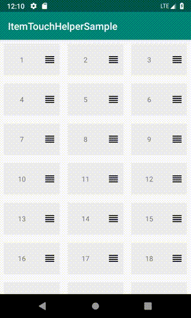

#### Google Play

## Example of ItemTouchHelper

This is a sample app for reordering a Grid list via drag-and-drop, implemented in Kotlin, inspired by the article:
[Drag and Swipe with RecyclerView — Part Two - Paul Burke - Medium](https://medium.com/@ipaulpro/drag-and-swipe-with-recyclerview-6a6f0c422efd)   

 
 
 
## Environments

- minSdkVersion 16
- targetSdkVersion 34
- AndroidX
- DataBinding
- Kotlin
